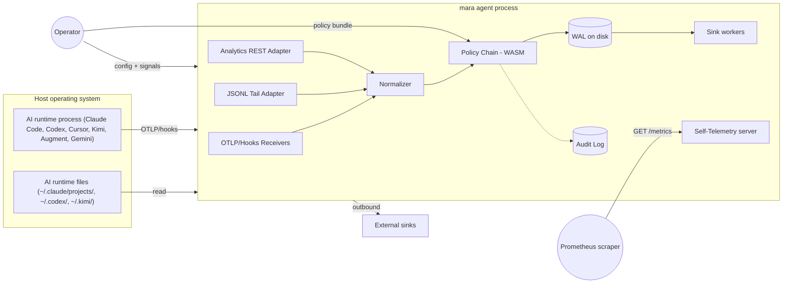

# Mara Threat Model (STRIDE)

**Status:** M4 baseline, draft awaiting external review.

This document analyses Mara's attack surfaces and documents mitigations for each. STRIDE categorises threats as Spoofing, Tampering, Repudiation, Information Disclosure, Denial of Service, and Elevation of Privilege.

The scope is Mara v1: the edge agent binary (`mara`) running on macOS, Linux, and Windows. The v2 gateway and v3 hosted control plane will receive their own threat models when those components mature.

## System decomposition

## Trust boundaries

1. **Host ↔ Mara process**: Mara reads files owned by the operator user (or another user if explicitly granted) and binds local sockets. The host kernel is trusted.
2. **Mara ↔ AI runtimes**: Mara accepts OTLP and JSONL produced by AI runtimes; the payloads are untrusted input.
3. **Inbound HTTP ↔ LLM proxy (`[[adapters.llm_proxy]]`)**: When `http_listen` is not loopback-only, any reachable client may send OpenAI/Ollama-shaped HTTP traffic. Callers are **untrusted**; see [`llm-proxy-non-loopback-threat-model.md`](llm-proxy-non-loopback-threat-model.md).
4. **Mara ↔ external sinks**: Mara initiates outbound TLS connections to operator-configured sinks. Sinks are trusted to receive but not assumed to be honest.
5. **Mara ↔ policy bundle authors**: Bundles are signed by their authors; Mara verifies signatures via `cosign`.
6. **Mara ↔ operator (config)**: Config files and process signals are operator-authoritative. Operator is trusted; we still validate.

## Asset inventory

- **Telemetry events in transit** (in-memory channels + WAL).
- **Configuration** (file with secret references).
- **Policy bundles** (WASM modules + manifests + signatures).
- **Audit log** (Merkle-rooted, tamper-evident).
- **Operator credentials** for sinks (referenced only, never stored unencrypted by Mara).
- **PII/PHI/PCI within events** (only when capture is opted in; otherwise redacted / hashed).
- **The Mara binary itself** (supply chain target).

## STRIDE analysis

### Spoofing

| Threat | Surface | Likelihood | Impact | Mitigation |
|---|---|---|---|---|
| Untrusted process connects to OTLP gRPC receiver and injects bogus events | Adapter | Medium | Medium | Default bind to `127.0.0.1`; mTLS required for non-loopback binds; document the threat in the operator quickstart. |
| Untrusted HTTP client reaches LLM reverse proxy on a non-loopback bind | LLM proxy | High | High | Refuse non-loopback `http_listen` unless `allow_non_loopback_listen`; operator must place TLS + auth in front; see [`llm-proxy-non-loopback-threat-model.md`](llm-proxy-non-loopback-threat-model.md). |
| Forged policy bundle | Policy loader | Medium | High | `cosign`-verified signatures; unsigned bundles require explicit `--allow-unsigned-policy`. Default reject. |
| Spoofed sink endpoint (DNS hijack, TLS-MITM) | Sink output | Low | High | TLS 1.3 required; certificate verification on by default; per-sink CA pinning supported. |
| Spoofed operator signal (HUP) from another process | Process | Low | Low | POSIX signal handling is sender-authenticated by the kernel; same-user constraint applies. |

### Tampering

| Threat | Surface | Likelihood | Impact | Mitigation |
|---|---|---|---|---|
| Config file replaced or modified by another local user | Config | Medium | High | Documented permission model (config readable only by the Mara user); JSON Schema validation on reload; per-file SHA hashes in the audit log on every reload. |
| WAL records tampered after-the-fact | WAL | Low | Medium | Per-record CRC; on-disk format documented; future v2 adds Merkle chain extending the audit log. |
| Audit log tampering | Audit | Medium | Critical | Append-only file with periodic Merkle root export to an operator-chosen external sink (e.g., S3 with Object Lock). |
| In-flight memory tampering | Process | Low | Critical | Standard OS process isolation; running as unprivileged user reduces blast radius; `unsafe_code = forbid` workspace lint blocks unsafe Rust. |
| Policy bundle in OCI registry tampered | Bundle distribution | Medium | High | Cosign keyless via Sigstore + Rekor transparency log; pin by digest, not tag. |

### Repudiation

| Threat | Surface | Likelihood | Impact | Mitigation |
|---|---|---|---|---|
| Operator denies having approved a policy change | Audit | Medium | Medium | Audit log records SHA of policy bundle, signer identity (from Fulcio cert), and timestamp at load. |
| Adapter claims to have sent events it didn't | Pipeline | Low | Low | Per-pipeline metrics (`mara_pipeline_events_total`) are scraped externally; correlate with downstream sink counts. |
| Denial of an emitted event | Audit | Medium | Medium | Audit log includes a hash of each material event; correlate with sink-side observations. |

### Information disclosure

| Threat | Surface | Likelihood | Impact | Mitigation |
|---|---|---|---|---|
| Prompt content leaking into logs or sinks | Pipeline | High | High | Default capture-optin = false everywhere; ZDR toggle honoured agent-side; PII pack redacts even when capture is enabled. |
| Secrets in config showing up in logs / metrics / error messages | Config | Medium | High | Secret references `@file:` and `@vault:` are resolved lazily; never logged; error messages use placeholders. |
| Adapter capturing files outside its configured scope | JSONL adapter | Low | High | Canonical-path resolution; symlinks rejected unless explicitly opted in; documented per-adapter glob constraints. |
| DNS-based exfiltration by a compromised WASM policy | Policy host | Low | High | WASM sandbox denies network access by default; Wasmtime config audited. |
| Mara self-telemetry leaking sensitive data | Self-tel | Low | Medium | Self-telemetry never captures user event content; documented contract. |
| Side-channel via metric cardinality (prompt fragments as labels) | Sink mapping | Medium | Medium | Documented sink-mapping rules cap label cardinality; cardinality-overrun metric alerts. |

### Denial of service

| Threat | Surface | Likelihood | Impact | Mitigation |
|---|---|---|---|---|
| OTLP receiver flooded with oversized payloads | Receivers | Medium | Medium | Bounded message sizes (tonic config); per-connection back-pressure. |
| LLM proxy connection or body flood from the network | LLM proxy | Medium | High | Loopback default; non-loopback opt-in; `max_body_bytes` caps buffered bodies; no global connection cap yet—use firewall / front proxy; see [`llm-proxy-non-loopback-threat-model.md`](llm-proxy-non-loopback-threat-model.md). |
| Regex DoS in policy redaction | Policy | Medium | High | `regex` crate is linear-time by construction; custom packs validated at load. |
| WAL filling disk | WAL | Medium | High | Bounded size and age; metric on usage; overflow defaults to drop-oldest with operator alert. |
| Slow sink causing event accumulation | Sinks | High | Medium | Per-sink WAL offsets independent; configurable backpressure; per-sink rate limit. |
| Pathological JSONL line (a 1 GiB single line) | JSONL adapter | Low | Medium | Bounded line size (default 10 MiB); over-budget lines truncated with `mara.line.truncated = true` flag. |
| Malicious WASM consuming CPU | Policy | Low | Medium | Per-event time budget enforced by Wasmtime. |
| Fork-bomb via hooks subprocess | Hooks adapter | Low | Low | Mara invokes subprocesses with controlled args; subprocess concurrency capped per adapter. |

### Elevation of privilege

| Threat | Surface | Likelihood | Impact | Mitigation |
|---|---|---|---|---|
| Adapter induced to read root-owned files | JSONL adapter | Low | High | Mara runs unprivileged by default; OS permissions are the final gate. |
| Policy WASM escape | Policy host | Low | Critical | Wasmtime sandbox; capability gates; sandbox audited. |
| Local user reading another user's WAL | WAL | Low | High | WAL stored under user-owned directory; mode `0600` on creation; documented. |
| Sink credentials exfiltrated | Config | Low | High | Secrets referenced not embedded; sink credentials never logged. |
| Supply-chain compromise of the Mara binary | Distribution | Low | Critical | SBOM + SLSA L2 provenance + cosign signing on every release; release workflow documented; reproducible-build best-effort. |
| Compromised dependency | Build | Medium | High | `cargo-audit`, `cargo-deny`, `cargo-vet`, OSV scanner gate every PR; Dependabot updates. |

## Cross-cutting controls

- **Zero phone-home**: Mara emits no telemetry to ArdurAI by default; only operator-configured sinks.
- **Apache 2.0 + DCO**: clear chain of contribution attribution.
- **Workspace lint `unsafe_code = forbid`**: no `unsafe` blocks in first-party Mara crates.
- **Per-release attestation**: SBOM (CycloneDX + SPDX), SLSA L2 provenance, `cosign` signature.
- **Documented security policy**: see [`../SECURITY.md`](../SECURITY.md).

## Out of scope for v1

- Kernel-level attestation (TPM, SEV-SNP).
- Hardware-isolated key storage.
- Compromised host operating system.
- Insider threats from operator with shell access (we accept the operator as authoritative).
- Denial-of-service amplification attacks via Mara (we are inbound + outbound, not a reflector).

## Updates

This document is reviewed at every release. Material changes trigger a new revision; minor wording goes via normal PR.

## References

- STRIDE methodology: <https://learn.microsoft.com/en-us/azure/security/develop/threat-modeling-tool-threats>.
- SLSA: <https://slsa.dev>.
- sigstore / cosign: <https://docs.sigstore.dev>.
- Wasmtime security model: <https://docs.wasmtime.dev/security.html>.
- [`plans/05-evaluation/03-soc2-control-mapping.md`](../plans/05-evaluation/03-soc2-control-mapping.md).
- [`plans/01-landscape/06-security-and-compliance.md`](../plans/01-landscape/06-security-and-compliance.md).
- [`SECURITY.md`](../SECURITY.md).
- [`llm-proxy-non-loopback-threat-model.md`](llm-proxy-non-loopback-threat-model.md) — LLM HTTP proxy when `http_listen` is not loopback-only.
