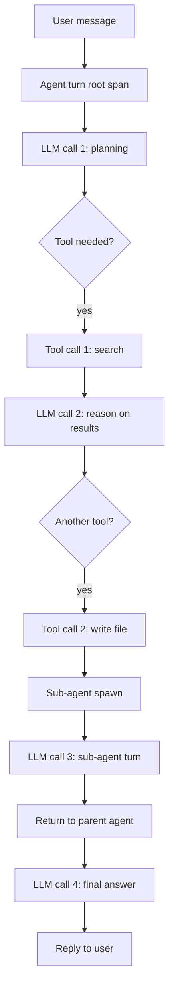

# Agent Loop Observability Gaps

## Executive summary

Multi-turn agents — the kind that call a model, call tools, call sub-agents, return to the model, retry, branch — are the new normal. Their telemetry shape is a tree, not a list. Observing them well requires propagating trace context across LLM calls, tool invocations, MCP boundaries, and async hops, and then rendering that tree faithfully in the sink. Today, this works partially. This document catalogs where it breaks and what Mara does about it.

## The shape of an agent turn

A non-trivial agent turn looks like:

Realistic agent turns have 5–50 nodes. Some have hundreds.

## Gap 1 — Trace context propagation drops at boundaries

W3C Trace Context (`traceparent` header) propagates IDs across HTTP boundaries when both sides honor it. In practice:

- **OTel-instrumented LLM SDKs:** propagation works.
- **MCP servers:** mostly do not propagate trace context as of May 2026; the MCP spec doesn't mandate it.
- **CLI tools shelling out to subprocesses:** propagation requires explicit env var passing.
- **Async queue + worker patterns:** propagation requires explicit payload field.

**Mara approach:** Mara preserves whatever `trace_id` / `span_id` arrives on each event. When the runtime supplies a `mara.session.id` but no trace_id, Mara generates a synthetic trace from the session id so downstream backends can group events. Synthetic traces are flagged with `mara.trace.synthetic = true`.

## Gap 2 — Span parent/child relationships are inconsistent

- Some SDKs put each tool call as a child of the LLM call that requested it.
- Some put each tool call as a sibling of the LLM call.
- Some flatten everything to children of the root turn.
- Sub-agent spawns are particularly inconsistent — sometimes a new trace, sometimes a child span, sometimes a separate session entirely.

**Mara approach:** canonical schema records `span_id` and `parent_span_id` as received; documented mapping rules per runtime in each preset; a `mara.agent.depth` extension tracks nesting level when parent-child is ambiguous.

## Gap 3 — Streaming responses fragment the picture

A streaming LLM call emits tokens over time. Some SDKs emit one span per call with cumulative usage at the end; others emit per-token events; others fold everything into a single attribute bag at completion.

**Mara approach:** canonical schema treats streaming as a single span with `gen_ai.response.is_streaming = true` and `gen_ai.streaming.tokens_observed` as a periodic update via metric events. Per-token events are dropped to control cardinality; the operator can opt into a `streaming_detail` policy if they want them.

## Gap 4 — Tool result truncation hides errors

Tools sometimes return huge results (file contents, web pages). SDKs commonly truncate before sending back to the model. The truncation point is invisible. Errors that resulted from truncation (model "saw" partial data, made bad call) are hard to diagnose.

**Mara approach:** when a tool result event includes a `gen_ai.tool.result.truncated = true` flag (or Mara detects truncation heuristically), the full result hash is captured plus the truncation length. Investigations can recover the full result from logs if the operator opted into raw capture.

## Gap 5 — Sub-agent fan-out is rarely tracked

A coordinator agent that spawns N worker sub-agents, each doing different work, can be hard to visualize. Most backends will show a wide trace tree but may not let you filter "all spans for sub-agent #3."

**Mara approach:** `mara.agent.name` and `mara.agent.id` extensions identify which agent instance produced each event. Sinks that support attributes-as-labels can filter cleanly.

## Gap 6 — MCP tool catalog drift

A team adds a new MCP server. Suddenly tools appear in agent transcripts that no documentation describes. Six months later, the team can't tell which tool calls came from which MCP server because the MCP server's identity wasn't always recorded.

**Mara approach:** `mcp.server.name`, `mcp.server.version`, `mcp.protocol.version` captured as part of `mcp.*` semconv. Documented in the canonical schema.

## Gap 7 — Authorization decisions inside MCP tools

A user with role X invokes tool Y via MCP; tool Y rejects. The agent sees a tool error. The observability tools see "tool error" without context that this was an authorization decision.

**Mara approach:** policy can classify tool-result events; classification appears as `mara.policy.classification` attribute. Operators can author classifiers to surface auth failures distinctly.

## Gap 8 — Retry chains are noisy

A flaky vendor produces 5 retries before the call succeeds. Each retry is an event. Aggregation in the sink can be either too aggregating (loses information) or not aggregating enough (10x event volume).

**Mara approach:** retry events carry `mara.retry.attempt` and `mara.retry.is_final`. Default sampling policy can keep just the final + summary of retries; verbose policy keeps all.

## Gap 9 — Async / queued agent steps lose context

Some agents enqueue work to be picked up later (e.g., a long-running tool result polled asynchronously). The span that resumes work is often a new trace.

**Mara approach:** canonical schema includes `mara.continuation.of_span_id` for "this span resumes that one." Sinks that join on this attribute can reconstruct the logical agent turn.

## Gap 10 — Pre-emption and cancellation

A user cancels a Claude Code session mid-turn. The agent's spans never close. The trace looks "open" forever.

**Mara approach:** when an adapter detects session termination (file close, hook payload), Mara emits a synthetic `mara.session.terminated_at` event so sinks can close trace UIs.

## Gap 11 — Cost across an agent turn

A single user message can cost dollars across many LLM calls and many tool invocations. Aggregating across the turn requires summing all `gen_ai.usage.*` and `mara.cost.usd` events with the same `mara.turn.id`.

**Mara approach:** canonical schema includes `mara.turn.id`; sinks can aggregate. Default Grafana dashboard for Tempo (or Honeycomb) shows turn-level cost rollups via attribute query.

## Per-tenant attribution

For SaaS operators running multi-tenant agents:

- Every event carries `mara.tenant.id` when the adapter or upstream emits it.
- Policy chains can be selected per tenant (v1 via static config; v2 via gateway-pushed dynamic config).
- Cost aggregation by tenant happens in the sink.

## Hybrid cloud + edge correlation

Scenarios:

- Developer's local Claude Code session calls a cloud-hosted MCP server.
- A cloud agent calls a tool that runs on a developer's laptop.

Trace context survives only if every hop propagates `traceparent`. As of May 2026 most MCP transports do not. Mara documents the workarounds:

- The MCP server can be wrapped with a Mara-aware shim that propagates trace context.
- Where shim wrapping isn't possible, Mara stitches by session id and timestamp heuristic, flagging `mara.trace.synthetic = true`.

## Reference implementations to study

- **OTel agents span conventions:** <https://github.com/open-telemetry/semantic-conventions/blob/main/docs/gen-ai/gen-ai-agent-spans.md>.
- **LangSmith agent visualization:** UI patterns for showing sub-agent trees.
- **Honeycomb derived columns for agent spans:** filtering and aggregation tricks.
- **MCP context propagation discussion:** <https://github.com/modelcontextprotocol/specification/issues>.

## Open questions

- Should Mara try to actively propagate `traceparent` into MCP calls when running as an MCP proxy? (Probably yes, v1.x.)
- Should Mara provide a sub-agent visualization tool, or leave that to sinks? (Leave to sinks.)
- How do we represent agent failures that happen across multiple retries / sub-agents in one canonical event? (Open.)

## What Mara explicitly leaves to others

- Building the trace visualization UI.
- Implementing agent-loop time-travel debugging.
- Replaying agent sessions against a different model for A/B testing.

These are tools-on-top that consume Mara's canonical events. Phoenix, Langfuse, LangSmith and others do them well already.
