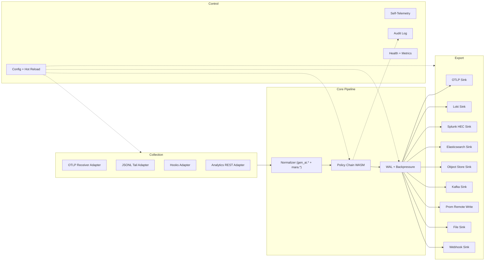
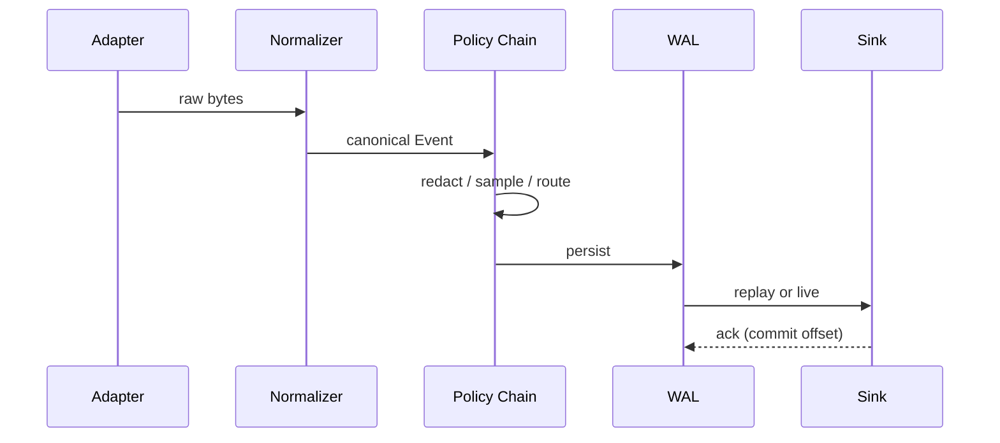

# Architecture Blocks

## Executive summary

Mara is built as a Rust Cargo workspace of focused crates that compose into a single binary (the v1 agent) and, in v2, a second binary (the gateway). The architecture has four layers — collection, normalization+policy, buffering, export — orchestrated by a typed pipeline scheduler. Every layer has stable trait boundaries so adapters, policies, and sinks can be developed and released independently.

## Layered view



## Crate layout

Workspace at `mara/`:

```
Cargo.toml                          # workspace
crates/
  mara-core/                        # pipeline scheduler, traits, WAL, backpressure
  mara-schema/                      # gen_ai.* + mara.* canonical types, codegen
  mara-policy/                      # WASM host, OPA shim, built-in primitives
  mara-adapters/
    otlp/                           # OTLP receiver
    jsonl/                          # JSONL tail with checkpoint
    hooks/                          # subprocess JSON-over-stdio and HTTP hooks
    analytics/                      # REST poller
  mara-runtimes/
    claude_code/                    # preset: JSONL + OTLP, ZDR-aware
    codex/                          # preset: OTLP + JSONL + notify hook
    cursor/                         # preset: hooks
    kimi/                           # preset: JSONL + stream-json
    augment/                        # preset: analytics REST
    gemini/                         # preset: OTLP
  mara-sinks/
    otlp/                           # gRPC + HTTP/protobuf + HTTP/JSON
    loki/                           # HTTP push API
    splunk_hec/                     # HEC with optional ack mode
    elasticsearch/                  # bulk API
    object_store/                   # S3/GCS/Azure via object_store crate
    kafka/                          # rdkafka
    prom_rw/                        # Prometheus remote write
    file/                           # local rotation
    webhook/                        # generic HTTPS POST
  mara-cli/                         # the `mara` binary
  mara-gateway/                     # v2 binary (placeholder in v1)
xtask/                              # codegen for semconv + release tooling
docs/
  adr/                              # Architecture Decision Records
benches/                            # workspace-level benchmarks
tests/                              # workspace-level integration tests
```

## Crate responsibilities

### `mara-core`

The brain. Owns:

- The `Event` and `EventBatch` types backed by `mara-schema`.
- The `Adapter`, `Sink`, `Policy` traits.
- The async pipeline scheduler (tokio-based, bounded channels).
- The WAL implementation.
- The backpressure controller.
- The configuration loader and JSON-schema validator.
- The hot reload mechanism (signal/inotify dispatch).
- The plugin loader (dynamic, for first-party plugins compiled in by default).

No I/O for sinks or adapters lives here. Only orchestration.

### `mara-schema`

Generated and hand-written types for the canonical event model. Generated from a pinned commit of the OpenTelemetry semantic conventions repo. Hand-written for `mara.*` extensions. Source of truth for what fields exist and what they mean. See [`04-data-model.md`](04-data-model.md).

### `mara-policy`

The policy execution layer. Owns:

- WASM host (`wasmtime`) with capability gates (no network, no filesystem, deterministic time).
- Built-in primitive policies (no WASM): regex redaction, sampling, rate limiting, drop, route.
- OPA/Rego shim packaged as a WASM module.
- Policy bundle loader: file, HTTP, OCI, S3.
- `cosign` signature verifier.
- Audit log writer.

### `mara-adapters/*`

One crate per **collection pattern**, not per runtime. Each implements the `Adapter` trait. Each is independently testable with fixture inputs.

### `mara-runtimes/*`

One crate per **AI runtime**. Each is a thin preset that:

- Defines default adapter configurations.
- Defines runtime-specific normalization (e.g., mapping Claude Code's `transcript_path` JSONL records into `gen_ai.*` events).
- Defines recommended policies (e.g., redact Anthropic API keys).
- Defines recommended sinks (none — operators choose).
- Provides `mara setup <runtime>` integration.

### `mara-sinks/*`

One crate per **sink destination**. Each implements the `Sink` trait. Each has its own retry/backoff/circuit-breaker logic appropriate to the destination.

### `mara-cli`

The binary. Wires everything together via clap subcommands. Almost no business logic — just orchestration of the other crates and the user-facing UX.

### `mara-gateway`

v1: placeholder crate that compiles to a stub binary, just to keep the workspace coherent.
v2: a separate binary built from `mara-core` + selected adapters + selected sinks + clustering logic.

### `xtask`

Cargo's xtask pattern for project-internal scripts: semconv codegen, release tagging, license header insertion, etc. Not shipped as a binary.

## Key traits (sketch)

```rust
// mara-core/src/traits.rs

#[async_trait]
pub trait Adapter: Send + Sync {
    fn name(&self) -> &str;
    async fn start(&self, sink: EventSender) -> Result<()>;
    async fn shutdown(&self) -> Result<()>;
    fn health(&self) -> Health;
}

#[async_trait]
pub trait Policy: Send + Sync {
    fn name(&self) -> &str;
    async fn apply(&self, ev: Event, ctx: &PolicyContext) -> PolicyOutcome;
}

#[async_trait]
pub trait Sink: Send + Sync {
    fn name(&self) -> &str;
    async fn start(&self, source: EventReceiver) -> Result<()>;
    async fn shutdown(&self) -> Result<()>;
    fn health(&self) -> Health;
}
```

Detailed trait surfaces are frozen in M1 and live in `crates/mara-core/src/traits/`. Trait stability is governed by `#[non_exhaustive]` and an explicit "trait change requires ADR" rule documented in `CONTRIBUTING.md`.

## Pipeline scheduler

The scheduler is a tokio-based actor system where each adapter, policy stage, and sink runs in its own task with bounded channels between them. Backpressure is enforced by bounded `tokio::sync::mpsc` channels plus per-pipeline token buckets at producer entry.



## Configuration topology

Mara's runtime configuration is a graph: a set of adapters, a set of pipelines (each pipeline declares which adapters feed it, which policy chain applies, which sinks consume it), plus global settings. Pipelines are the unit of scaling — multiple pipelines run concurrently and isolate failures.

```toml
[server]
metrics_addr = "127.0.0.1:9099"
log_format = "json"

[[adapters.otlp]]
name = "ingest_otlp"
grpc_listen = "0.0.0.0:4317"
http_listen = "0.0.0.0:4318"

[[adapters.jsonl]]
name = "claude_code_tail"
globs = ["~/.claude/projects/**/*.jsonl"]
checkpoint_path = "${XDG_STATE_HOME}/mara/checkpoints/claude_code"

[[pipelines]]
name = "primary"
adapters = ["ingest_otlp", "claude_code_tail"]
policy_chain = "default"
sinks = ["loki_local", "s3_backup"]
wal = { dir = "${XDG_DATA_HOME}/mara/wal", max_bytes = "1GiB", max_age = "4h" }

[[policies.default]]
type = "redact"
pack = "builtin.pii"
[[policies.default]]
type = "sample"
strategy = "head"
rate = 1.0

[[sinks.loki]]
name = "loki_local"
url = "http://localhost:3100/loki/api/v1/push"
[[sinks.object_store]]
name = "s3_backup"
url = "s3://mara-archive/${YYYY}/${MM}/${DD}/"
format = "parquet"
```

## Failure isolation

- Each adapter, policy stage, and sink runs in its own tokio task. A panic in one MUST NOT take down the agent (catch-unwind boundary on each task).
- Sinks failing for longer than the WAL budget MUST NOT block other sinks — independent per-sink offsets.
- Policy stages that fail MUST default to deny-and-record rather than allow-and-log; configurable per policy.

## Versioning and ABI

- `mara-core` and `mara-schema` follow strict SemVer.
- Trait changes are minor-version bumps with deprecation cycles per NFR-8.
- The WAL format is versioned with a magic header byte; upgrade migrates on first open.
- The plugin ABI (for dynamic loading of third-party adapter/sink crates) is explicit: a `mara_plugin_v1` C ABI with a Rust SDK wrapper. Plugins ship as `.dylib` / `.so` / `.dll`. Plugin ABI stabilization is v2 work.

## Build matrix

CI builds for:

- `x86_64-unknown-linux-gnu`
- `x86_64-unknown-linux-musl`
- `aarch64-unknown-linux-gnu`
- `aarch64-unknown-linux-musl`
- `aarch64-apple-darwin`
- `x86_64-apple-darwin`
- `x86_64-pc-windows-msvc`

macOS releases ship as `universal2` (x86_64 + arm64 lipo'd).

## Relationship to OpenTelemetry Collector

A natural question: why not just write Mara as an OTel Collector distribution?

- Collector is Go; we want Rust for size, startup time, and memory ceiling.
- Collector's receiver/processor/exporter model is generic; we need AI-runtime presets and `gen_ai.*`-aware normalization first-class.
- The hooks adapter (subprocess JSON-over-stdio) doesn't fit Collector's receiver model cleanly.
- We want signed policy bundles as core; Collector treats this as a custom processor concern.

Mara stays aligned with OTel via the OTLP adapter and sink, the semconv, and ongoing upstream contributions. If a future OTel distribution covers the AI-runtime presets natively, Mara reconsiders its existence.
