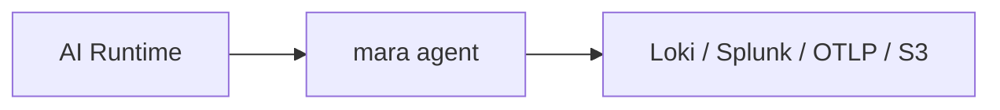
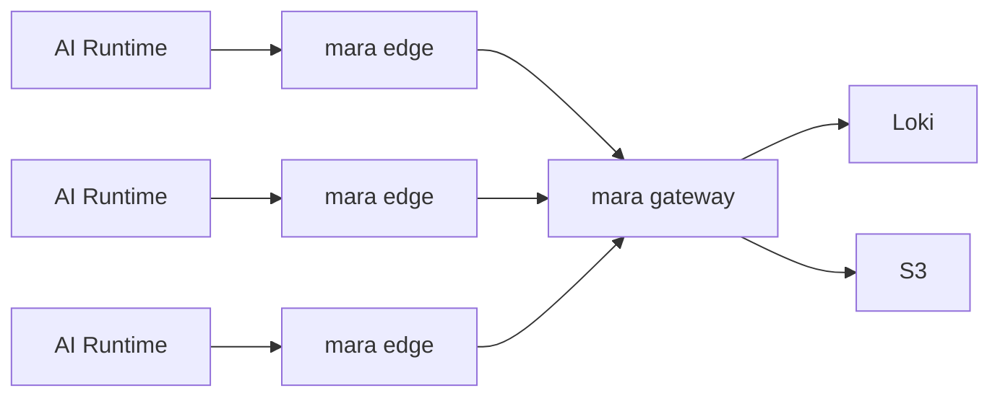
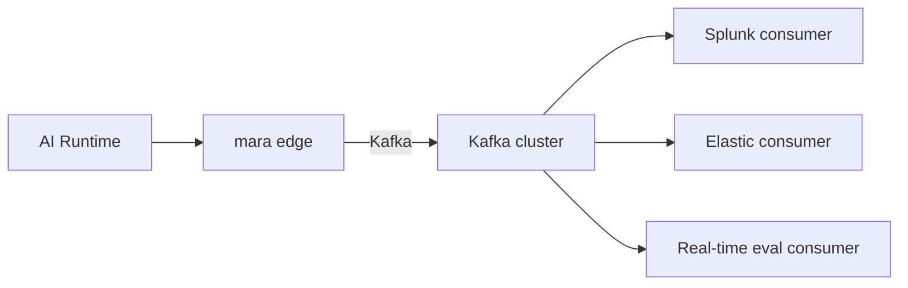
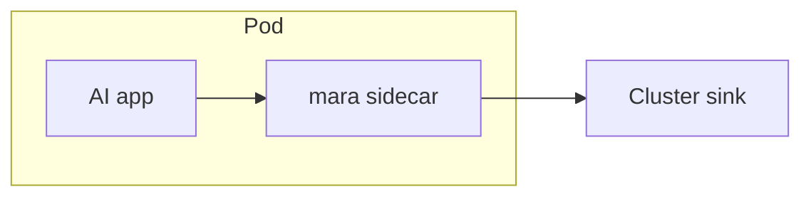
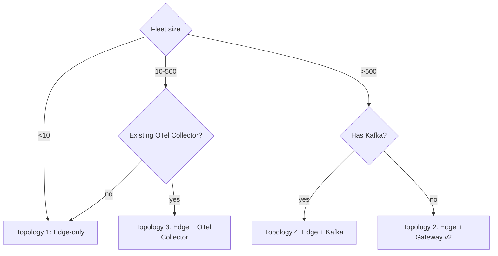

# Pipeline Topologies

## Executive summary

Mara supports five pipeline topologies. Operators pick whichever fits the workload. v1 ships all five via configuration; no special build is required. Choosing the right topology is the single biggest operational decision an operator makes.

## Topology 1 — Edge-only (v1 default)

Single Mara agent per host, runs alongside the AI runtime, ships directly to one or more sinks.



**Use when:** small fleets, indie developers, single-tenant SaaS, no aggregation requirement.

**Pros:** simplest, lowest latency, no aggregation tier to operate.

**Cons:** every host needs sink credentials; per-host policy management; no cross-host correlation at the shipper layer.

## Topology 2 — Edge + per-cluster aggregator (v2 gateway)

Edge agents on each host ship to a regional/cluster aggregator that buffers, applies cross-host policy, and fans out to sinks.



**Use when:** large fleets, central credential management, cross-host sampling, regional egress optimization.

**Pros:** central policy distribution; aggregated metrics; sink credentials live only on the gateway.

**Cons:** an additional tier to operate; latency penalty from extra hop; gateway becomes an attractive target.

**Status:** edge half ships in v1, gateway in v2. The same Cargo workspace builds both binaries.

## Topology 3 — Edge + OTel Collector (v1 supported via OTLP)

Mara edge agents ship OTLP to an existing OpenTelemetry Collector instance, which the operator already runs.


**Use when:** the operator has a healthy OTel Collector pipeline and wants Mara only for the AI-runtime-aware collection and policy stage.

**Pros:** zero disruption to existing observability infra; OTel Collector handles vendor-specific exporters.

**Cons:** redaction must happen agent-side (or in Collector); two systems to operate.

## Topology 4 — Edge + Kafka spine

Mara edge agents ship to Kafka; downstream consumers (Splunk, Elastic, custom ingestion) pull from Kafka.



**Use when:** large enterprises with Kafka as the standard data backbone; need at-least-once with consumer replay; want decoupled downstream evolution.

**Pros:** durable spine; multiple consumers; back-pressure handled by Kafka.

**Cons:** Kafka operational burden; non-trivial schema evolution discipline.

## Topology 5 — Sidecar in Kubernetes Pod

Each AI-using application Pod has a Mara sidecar that collects from the colocated app and ships to a cluster sink or external aggregator.



**Use when:** per-app policy customization in shared clusters; tenant isolation requirements; app needs ZDR-strict opt-in toggle.

**Pros:** per-app policy without DaemonSet privilege; tenant-bounded resource limits.

**Cons:** per-pod memory cost (≈128 MiB × pod count); duplicated config management; the DaemonSet pattern is usually preferred.

## Topology decision matrix

The right topology depends on five axes:

1. **Fleet size.** <10 nodes → Topology 1. 10–500 → Topology 1 or 3 (with existing OTel Collector). 500+ → Topology 2 or 4.
2. **Policy distribution.** Central required → Topology 2 (gateway pushes bundles). Local OK → Topologies 1, 3, 5.
3. **Cross-host correlation.** Needed at the shipper → Topology 2 or 4. Done in the backend → any topology.
4. **Existing infrastructure.** OTel Collector present → Topology 3 is least disruptive. Kafka present → Topology 4 is natural.
5. **Compliance requirements.** Tamper-evident audit log per-host → all topologies. Central audit with provable chain → Topology 2 (gateway commits Merkle roots).

## Pipeline definitions inside a single Mara process

Inside one Mara process there can be multiple **pipelines**. Each pipeline is an independent (adapters → policy chain → sinks) graph that runs concurrently and isolates failures.

```toml
[[pipelines]]
name = "claude_code_to_loki"
adapters = ["claude_code_jsonl", "claude_code_otlp"]
policy_chain = "pii_redact_minimal"
sinks = ["loki_local"]

[[pipelines]]
name = "all_runtimes_to_s3"
adapters = ["claude_code_jsonl", "codex_jsonl", "cursor_hooks", "kimi_jsonl", "gemini_otlp", "augment_analytics"]
policy_chain = "pii_redact_strict"
sinks = ["s3_archive"]

[[pipelines]]
name = "metrics_only"
adapters = ["claude_code_otlp", "codex_otlp", "gemini_otlp"]
policy_chain = "cost_only"   # transforms cost events, drops the rest
sinks = ["prom_rw_local"]
```

Pipelines share adapters (an adapter can feed multiple pipelines via a fan-out) but have independent policy chains and sink sets. This composition pattern is borrowed from Fluent Bit's `[FILTER]` chains and OTel Collector's pipelines, generalized.

## Backpressure across topologies

- **Topology 1:** producer throttling at adapter entry; WAL on disk; if WAL fills, oldest events drop unless `wal.overflow = "block"`.
- **Topology 2:** gateway applies its own producer throttle on inbound from edges; edges respect 429s with exponential backoff; per-edge WAL absorbs gateway outages.
- **Topology 3:** OTel Collector's own back-pressure mechanisms apply; Mara respects 429/503 from the Collector.
- **Topology 4:** Kafka producer respects `linger.ms`, `max.in.flight.requests`, retries idempotently; back-pressure surfaces as broker latency.
- **Topology 5:** sidecar memory budget hard-caps in-flight events; spillover to sidecar WAL.

## Failure scenarios and behavior

- **Sink offline for 1 hour, WAL has budget:** all events buffered, replayed on sink recovery, zero loss.
- **Sink offline for 4 hours (WAL budget exhausted):** events drop oldest-first; metric `mara_wal_drops_total` increments; alert.
- **Mara process SIGKILLed:** WAL preserves committed events; on restart, replay from last committed offset; ≤1s loss bound.
- **Adapter crash (panic in a tokio task):** isolated by catch-unwind boundary; adapter restarts with backoff; other adapters/sinks unaffected.
- **Policy chain throws (WASM trap):** event routed to dead-letter with `policy_trap` reason; metric `mara_policy_traps_total` increments.

## Topology choice flowchart



Sidecar (Topology 5) is selected when per-Pod policy isolation is required; otherwise DaemonSet (a subset of Topology 1) is preferred in Kubernetes.

## Documentation per topology

Each topology gets its own deployment blueprint:

- Topology 1 + DaemonSet: [`../06-deployment-blueprints/04-kubernetes-daemonset.md`](../06-deployment-blueprints/04-kubernetes-daemonset.md).
- Topology 5 sidecar: [`../06-deployment-blueprints/05-kubernetes-sidecar.md`](../06-deployment-blueprints/05-kubernetes-sidecar.md).
- macOS/Linux/Windows Topology 1: [`../06-deployment-blueprints/01-macos-launchd.md`](../06-deployment-blueprints/01-macos-launchd.md), [`02-linux-systemd.md`](../06-deployment-blueprints/02-linux-systemd.md), [`03-windows-service.md`](../06-deployment-blueprints/03-windows-service.md).
- Serverless Topology 1: [`../06-deployment-blueprints/06-serverless-lambda-extension.md`](../06-deployment-blueprints/06-serverless-lambda-extension.md).
- Docker Compose Topology 1: [`../06-deployment-blueprints/07-docker-compose.md`](../06-deployment-blueprints/07-docker-compose.md).
- CI runners Topology 1: [`../06-deployment-blueprints/08-ci-runners.md`](../06-deployment-blueprints/08-ci-runners.md).
