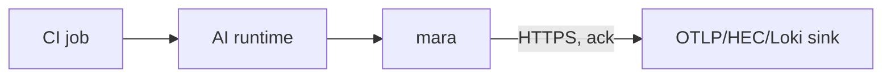

# CI Runner Deployment

## Executive summary

Mara can run inside ephemeral CI/CD job environments to capture AI-agent activity that happens during builds — for example, Codex running in `codex exec --json` mode inside a GitHub Actions job, or Claude Code running headless to refactor and PR. Because CI runners are short-lived (minutes), Mara's deployment posture is different: minimal install footprint, synchronous-ack sinks, no WAL reliance, and an explicit "flush before job ends" pattern.

## When to capture AI activity in CI

- AI-driven refactors / patches that need an audit trail.
- Automated review or test generation agents that run per-PR.
- Eval pipelines that exercise prompts at scale.
- Compliance: provable trail of every AI-tool action that produced code merged into a repo.

## Topology



Mara runs inside the same job container/VM as the AI runtime. Sinks are remote and accept HTTPS POST with ack semantics (OTLP-HTTP with ack, Splunk HEC with ack mode, Loki HTTP, generic webhook with synchronous response).

## GitHub Actions example (with Codex)

```yaml
name: AI refactor
on:
  workflow_dispatch:
    inputs:
      prompt:
        description: "Refactor instruction"
        required: true

jobs:
  refactor:
    runs-on: ubuntu-latest
    env:
      # Mara sink config
      MARA_SINK_OTLP_ENDPOINT: ${{ secrets.OTLP_ENDPOINT }}
      MARA_SINK_OTLP_HEADERS: ${{ secrets.OTLP_HEADERS }}
      # Codex OTel config to point at local Mara
      OTEL_EXPORTER_OTLP_ENDPOINT: http://127.0.0.1:4317
      CODEX_HOME: ${{ github.workspace }}/.codex
    steps:
      - uses: actions/checkout@v4

      - name: Install Mara
        run: |
          curl -fsSL https://github.com/ArdurAI/mara/releases/latest/download/mara-linux-amd64.tar.gz | tar xz
          sudo install -m 0755 mara /usr/local/bin/mara

      - name: Start Mara
        run: |
          cat > mara.toml <<'EOF'
          [server]
          metrics_addr = "127.0.0.1:9099"

          [[adapters.otlp]]
          name = "otlp_in"
          grpc_listen = "127.0.0.1:4317"
          http_listen = "127.0.0.1:4318"

          [[adapters.jsonl]]
          name = "codex_history"
          globs = ["${CODEX_HOME}/history.jsonl"]
          checkpoint_path = "${RUNNER_TEMP}/mara-checkpoints"

          [[pipelines]]
          name = "ci"
          adapters = ["otlp_in", "codex_history"]
          policy_chain = "ci_redact"
          sinks = ["remote_otlp"]
          wal = { dir = "${RUNNER_TEMP}/mara-wal", max_bytes = "64MiB", max_age = "30m" }

          [[policies.ci_redact]]
          type = "redact"
          pack = "builtin.pii"

          [[sinks.otlp]]
          name = "remote_otlp"
          endpoint = "${MARA_SINK_OTLP_ENDPOINT}"
          protocol = "http"
          headers = "${MARA_SINK_OTLP_HEADERS}"
          EOF

          nohup mara run --config mara.toml >mara.log 2>&1 &
          # Wait for Mara to come up
          for i in {1..30}; do
            if curl -sf http://127.0.0.1:9099/healthz; then break; fi
            sleep 1
          done

      - name: Install Codex
        run: |
          curl -fsSL https://example.com/install-codex.sh | bash

      - name: Run Codex
        run: |
          # Codex emits OTLP to Mara's local receiver per OTEL_EXPORTER_OTLP_ENDPOINT
          codex exec --json "$INPUT_PROMPT" > codex-output.json

      - name: Drain Mara
        if: always()
        run: |
          # Tell Mara to drain and exit; timeout 30s
          curl -sf -X POST http://127.0.0.1:9099/admin/drain
          # Wait for clean exit
          timeout 30 tail --pid $(pgrep mara) -f /dev/null || true

      - name: Capture mara log
        if: always()
        uses: actions/upload-artifact@v4
        with:
          name: mara-ci-log
          path: mara.log
```

## Key principles

- **Synchronous sinks.** WAL is meant for survival; CI runners don't survive. Use OTLP-HTTP with explicit ack response, or Splunk HEC with `ack=1`.
- **Short WAL budget.** 64 MiB / 30 minutes is plenty; you want to flush before job teardown.
- **Drain endpoint.** Mara exposes `POST /admin/drain` (FR-9 / future) that triggers a clean shutdown without SIGTERM (useful in environments where signal handling is awkward).
- **Always-flush step.** `if: always()` ensures the drain runs even on prior step failures.
- **Secrets in env.** Sink credentials come from CI secret store, never from a file checked into the repo.

## GitLab CI example (with Claude Code)

```yaml
ai_refactor:
  image: ubuntu:24.04
  variables:
    OTEL_EXPORTER_OTLP_ENDPOINT: http://127.0.0.1:4317
    CLAUDE_CODE_ENABLE_TELEMETRY: "1"
    OTEL_LOG_USER_PROMPTS: "false"   # ZDR-strict in CI
    OTEL_LOG_TOOL_DETAILS: "true"
  before_script:
    - apt-get update && apt-get install -y curl
    - curl -fsSL https://github.com/ArdurAI/mara/releases/latest/download/mara-linux-amd64.tar.gz | tar xz
    - install -m 0755 mara /usr/local/bin/mara
  script:
    - cp .ci/mara.toml mara.toml
    - mara run --config mara.toml &
    - claude --print "$AI_PROMPT" --output-format json
    - curl -sf -X POST http://127.0.0.1:9099/admin/drain
  after_script:
    - cat mara.log || true
```

## Buildkite agent example

For long-running self-hosted Buildkite agents that run AI-using pipelines, Mara is a regular Linux systemd service on the agent host (see [`02-linux-systemd.md`](02-linux-systemd.md)). All AI runtime activity in any job on that agent is captured automatically — no per-job install.

## Self-hosted runner pattern

For self-hosted GitHub Actions runners on persistent infrastructure (VMs that survive between jobs):

- Install Mara as a systemd service on the runner host (per the Linux blueprint).
- Mara captures both runner-level OTLP and any per-job JSONL.
- No per-job install/drain.
- Persistent WAL.

## Common pitfalls

- **Container CI environments that block outbound HTTPS** to sink endpoints. Verify network egress to the sink ahead of time.
- **Codex / Claude Code refusing to write to default config paths** in containers where home is `/root` or `/github/home`. Pin `CODEX_HOME`, `CLAUDE_HOME` explicitly per the env vars in the example.
- **Mara process not getting a clean shutdown** because the CI runner SIGKILLs everything at job end. The `/admin/drain` endpoint pre-flushes; without it, expect up to the WAL budget worth of un-flushed events.
- **Out-of-the-box GitHub Actions runners' clock skew** when comparing timestamps across services. Use absolute timestamps everywhere in queries.
- **Secrets leaking into logs** via Mara's debug log mode. Default `--log-level info` in CI; never use `--log-level trace` with prompt content in scope.

## Sink choice in CI

- **OTLP-HTTP** (recommended) — works with Honeycomb, Datadog, Grafana Cloud, self-hosted Tempo, Logfire, Phoenix, etc.
- **Splunk HEC with `ack=1`** — synchronous ack ensures the runner doesn't exit before events land.
- **Loki HTTP push** — simple, low-latency.
- **S3 PutObject** — good for archive-style retention; per-call cost matters if EPS is high.
- **Generic webhook** — Slack, Discord, custom collectors.

Avoid Kafka in ephemeral CI (overhead of producer init not worth it). Avoid file sinks (lost at job end).

## Capturing artifacts

Beyond live shipping, Mara can write a `session.parquet` or `session.jsonl` to a known path that the CI uploads as a job artifact:

```toml
[[sinks.file]]
name = "session_artifact"
path = "${RUNNER_TEMP}/mara-session.parquet"
format = "parquet"
flush_on_shutdown = true
```

Then:

```yaml
- uses: actions/upload-artifact@v4
  if: always()
  with:
    name: mara-session
    path: ${{ runner.temp }}/mara-session.parquet
```

## Compliance angle

CI is often where the audit story is hardest — many tools run, many actions happen, and capturing AI-tool activity in particular is a regulatory ask. Mara's CI pattern provides:

- Tamper-evident audit trail per build (when audit log is enabled).
- ZDR-strict default (no prompt body capture without explicit opt-in).
- Reproducible build attestation can include a Mara-collected build-time AI-tool activity log alongside the SBOM.

## Performance considerations

- Mara adds ≈ 50–100 MiB RSS and a small CPU baseline to the runner. For a 10-minute job this is negligible; for a 30-second smoke job it's overhead. Decide per pipeline.
- Cold start ≈ 200 ms; subtract from job time budget.
