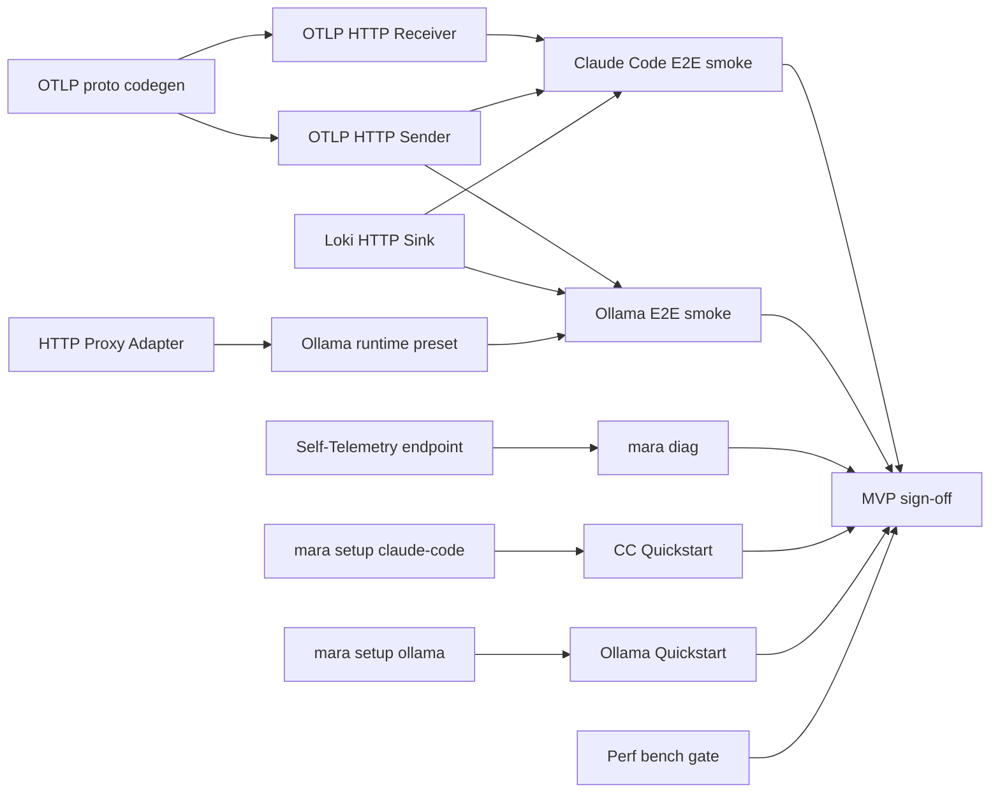

# MVP — Gap Analysis

## Executive summary

This document inventories what works today vs what is required for the MVP target defined in [`01-scope-and-decision-criteria.md`](01-scope-and-decision-criteria.md). The aim is a single page an engineer can scan to know exactly what is real, what is scaffold, and what each gap is worth in implementation effort.

## What works today (M0–M5 substantively delivered)

### Code that compiles and runs

- **Pipeline scheduler** (`mara-core::pipeline`). Adapters → policy chain → fan-out to sinks. Bounded async channels. Graceful shutdown. Test-covered.
- **TOML config loader** (`mara-core::config`). Cross-reference validation (pipelines must reference declared adapters and sinks; chain names must exist).
- **Canonical schema** (`mara-schema`). `Event`, `EventKind`, `Severity`, full `gen_ai.*` structure, `mcp.*`, `mara.*` extensions, attribute bag.
- **Trait surfaces** (`mara-core::traits`). `Adapter`, `Sink`, `Policy`, `EventSender`/`EventReceiver`, `Health`, `HealthStatus`.
- **JSONL tail adapter** (`mara-adapter-jsonl`). Per-file offset checkpointing, rotation handling via `OpenOptions::append`, line-by-line parsing into canonical events.
- **File rotation sink** (`mara-sink-file::FileSink`). Configurable byte threshold, named segment files, atomic append.
- **Stdout sink** (`mara-sink-file::StdoutSink`). Pretty or compact JSON output.
- **Built-in regex redactor** (`mara-policy::builtin::redact::RegexRedactor`). Pack of nine patterns covering common credentials and PII.
- **Built-in head sampler** (`mara-policy::builtin::sample::HeadSampler`). Probabilistic with deterministic seeded path for tests.
- **Policy chain runner** (`mara-core::policy::PolicyChain`). Pass / drop / route semantics.
- **CLI commands** that actually do something: `mara run`, `mara validate`, `mara version`.
- **45 tests** including the JSONL → policy → file end-to-end test in `tests/e2e_pipeline.rs`.

### Documentation, packaging, governance

- 48 planning documents under `plans/`.
- 7 ADRs under `docs/adr/`.
- Apache 2.0 license, NOTICE, CONTRIBUTING, SECURITY, CODE_OF_CONDUCT, SECURITY-ADVISORIES process.
- CI workflows (`ci.yml`, `security.yml`) and release workflow (`release.yml`) with cross-platform builds, SBOMs, cosign signing, SLSA provenance.
- Helm chart, systemd unit, launchd plist, Homebrew formula templates, Dockerfile.
- Compatibility matrix (`docs/compat-matrix.md`).
- STRIDE threat model (`docs/threat-model.md`).
- Operational runbook (`docs/runbook.md`).

## What is scaffold-only

The crates exist with `lib.rs` doc comments and tests for runtime IDs / default paths / suggested config templates, but contain no actual collection / export logic.

### Critical for MVP

- **OTLP HTTP/protobuf receiver** (`mara-adapter-otlp`). Empty crate. **Largest single gap.**
- **OTLP HTTP/protobuf sender** (`mara-sink-otlp`). Empty crate. **Second largest gap.**
- **HTTP proxy adapter** (`mara-adapter-llm-proxy`). New crate, not present at MVP start. **Third largest gap.** Required for Ollama. Design in [`12-ollama-integration-design.md`](12-ollama-integration-design.md).
- **Ollama runtime preset** (`mara-runtime-ollama`). New crate composing the proxy adapter with Ollama-specific request/response normalizers for native `/api/*` and OpenAI-compat `/v1/*` shapes.
- **Loki HTTP push sink** (`mara-sink-loki`). Empty crate.
- **`mara setup <preset>`**. CLI logs "not yet implemented." Must actually write a config; MVP needs `claude-code` and `ollama` presets.
- **Self-telemetry endpoint** (`:9099/metrics`, `/healthz`). Not bound anywhere.
- **`mara diag`**. Logs "not yet implemented."

### Not critical for MVP (deferred)

- gRPC OTLP receiver and sender (HTTP first; gRPC in MVP+1).
- Hooks adapter (`mara-adapter-hooks`) — needed for Cursor.
- Analytics REST adapter (`mara-adapter-analytics`) — needed for Augment.
- All other sinks: Splunk HEC, Elasticsearch, object store (S3/GCS/Azure), Kafka, Prom RW, generic webhook.
- WASM policy host (`mara-policy::wasm`).
- Signed policy bundle loader with `cosign` verification.
- Segmented append-only WAL.
- Tamper-evident audit log.
- `mara test pipeline`, `mara dlq` subcommands.
- `mara cursor-hook`, `mara codex-hook` glue subcommands.
- The other five runtimes' presets activated end-to-end.

## Estimated effort per gap

These are working estimates from someone who has built similar systems before. Multiply by 1.5x if the engineer is new to Rust async.

| Gap | Crate / location | Effort | Reason it's not trivial |
|-----|------------------|--------|--------------------------|
| OTLP HTTP/protobuf receiver | `mara-adapter-otlp` | ~5 days | Need OTLP proto codegen (use `opentelemetry-proto` crate or hand-roll prost). Implement HTTP server on 4318. Translate OTLP `LogRecord` and `Span` → canonical `Event`. Honour content encoding (gzip). |
| OTLP HTTP/protobuf sender | `mara-sink-otlp` | ~4 days | Translate `Event` → OTLP `LogRecord`. Batch + retry with exponential backoff + jitter. Bearer-token auth header. TLS via `rustls`. |
| HTTP proxy adapter | `mara-adapter-llm-proxy` | ~5 days | Bind local port; forward to upstream; capture request + response bodies (unary and SSE-streaming); pass through status codes faithfully; bounded body buffers; client-disconnect handling. Detailed in [`12-ollama-integration-design.md`](12-ollama-integration-design.md). |
| Ollama runtime preset | `mara-runtime-ollama` | ~3 days | Map native `/api/chat`, `/api/generate`, `/api/embed` + OpenAI-compat `/v1/*` request/response shapes into canonical `gen_ai.*` + `mara.ollama.*`. Token counts from `prompt_eval_count`/`eval_count`. Latency conversion from nanoseconds. |
| Loki HTTP push sink | `mara-sink-loki` | ~3 days | POST `/loki/api/v1/push` with stream-label model. Bounded label cardinality. Structured metadata for non-label fields. gzip body. |
| `mara setup claude-code` and `mara setup ollama` | `mara-cli::setup` | ~2 days | Detect OS, write to the right config dir, print next steps. Ollama variant prints `OLLAMA_HOST=127.0.0.1:11435` instruction. |
| Self-telemetry endpoint | `mara-core::self_telemetry` | ~2 days | `hyper` server. Prometheus exposition format encoder. Health-roll-up from pipeline component health. |
| `mara diag` | `mara-cli::diag` | ~1 day | Read from `/metrics` and `/healthz` if running, else inspect config and walk the state dir. |
| Quickstart hardening | `plans/07-quickstarts/01-claude-code.md` and `07-ollama.md` | ~2 days | Two runnable quickstarts. Scripted CI tests for both. |
| Bench + perf gate | `benches/`, CI | ~2 days | `criterion` harness, baseline JSON in repo, PR delta detection. |
| **Total MVP critical-path effort** | | **~29 working days** | One engineer, focused. ~6 weeks accounting for review, integration, and the Ollama-specific complexity of streaming-body proxy capture. |

## Dependencies between gaps

OTLP proto codegen and the proxy adapter are the two critical-path predecessors. They can be built in parallel (different engineers if available; same engineer in sequence if not).

## What MVP intentionally does not fix

These would each take 1–4 weeks on their own; deferring them is a deliberate scope decision. See [`01-scope-and-decision-criteria.md`](01-scope-and-decision-criteria.md) Options B and C for when they land.

- **WAL durability.** Sink outage during MVP causes events to drop with a `mara_wal_drops_total` metric. Documented behaviour, not a bug. Real WAL ships in Option C.
- **Multi-runtime.** Five of six runtimes stay as preset crates that compile but don't end-to-end smoke-test. Cursor needs the hooks adapter to be valuable.
- **WASM policy.** Built-in primitives only. Third-party signed bundles wait for Option C.
- **Multi-sink.** Three sinks (OTLP, Loki, file) cover ≥80 % of operator preferences in our target persona. The other six are valuable but not first-touch.

## Cross-references

- [`01-scope-and-decision-criteria.md`](01-scope-and-decision-criteria.md) — scope.
- [`06-mvp-implementation-plan.md`](06-mvp-implementation-plan.md) — week-by-week plan that closes these gaps.
- [`../04-implementation/03-architecture-blocks.md`](../04-implementation/03-architecture-blocks.md) — overall architecture.
- [`../04-implementation/07-phased-milestones.md`](../04-implementation/07-phased-milestones.md) — original MOS milestone view.
