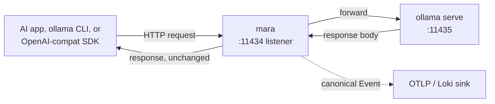

# MVP — Ollama Integration Design

## Executive summary

Ollama joins Claude Code as Mara's second MVP runtime. Its integration shape is fundamentally different: Claude Code emits OTLP that Mara receives; Ollama emits nothing usefully observable, so Mara must sit **in front of Ollama as an HTTP proxy** and observe each request/response pair. This document fixes the technical design — what bytes flow where, which Ollama fields we capture, which Mara crates implement it, and how we present the result to the user as a transparent drop-in. It also documents what is verifiable (from official Ollama docs as of May 2026) and what we are still relying on `[verify]` for.

The integration delivers an MVP-grade Ollama observability story without waiting for upstream Ollama to ship native OTel.

## What we verified

From <https://docs.ollama.com/api>, <https://docs.ollama.com/api/usage>, <https://docs.ollama.com/api/openai-compatibility>, <https://docs.ollama.com/faq>, <https://docs.ollama.com/troubleshooting>, <https://github.com/ollama/ollama>:

- Ollama HTTP server defaults to `127.0.0.1:11434`. Overrideable via `OLLAMA_HOST`.
- Native API: `/api/generate`, `/api/chat`, `/api/embed`, `/api/embeddings` (deprecated alias), `/api/tags`, `/api/show`, `/api/ps`, `/api/version`, `/api/pull`, `/api/push`, `/api/copy`, `/api/delete`, `/api/create`.
- OpenAI-compatible API: `/v1/chat/completions`, `/v1/completions`, `/v1/embeddings`, `/v1/models`, `/v1/models/{model}`, plus `/v1/responses` (added in v0.13.3) and experimental `/v1/images/generations`.
- Response telemetry fields (native API, in JSON body or final SSE chunk when streaming, `done=true`): `total_duration`, `load_duration`, `prompt_eval_count`, `prompt_eval_duration`, `eval_count`, `eval_duration`, `model`, `created_at`, `done`, `done_reason`. All durations are nanoseconds.
- OpenAI-compat path requires `include_usage: true` on streaming requests to populate token usage in the final chunk.
- Logs: macOS `~/.ollama/logs/server.log` and `~/.ollama/logs/app.log`; Linux `journalctl -u ollama`; Windows `%LOCALAPPDATA%\Ollama\server.log`. Format is **unstructured text** per the official troubleshooting page. **Logs do not carry token counts** in a structured form.
- No first-party Prometheus `/metrics` or OTel exporter shipped in stock Ollama as of release v0.21.0 (April 2026). PR <https://github.com/ollama/ollama/pull/6537> is open but unmerged.
- License: MIT (verified at <https://github.com/ollama/ollama/blob/main/LICENSE>).
- Reverse-proxying Ollama is officially supported and documented in the FAQ.

`[verify]` items at integration time:

- Exact response-field set may shift per version; pin to a tested Ollama range in `crates/mara-runtime-ollama/`.
- New endpoints since v0.13.3 (the `/v1/responses` line) need response-shape capture.

## Architectural choice: HTTP proxy adapter

The cleanest path to per-request observability for Ollama without modifying Ollama is for Mara to act as an HTTP proxy. The user reconfigures their AI clients to point at Mara instead of Ollama, and Mara forwards to Ollama on a second port.



Why proxy over the alternatives:

- **Log tail.** Ollama logs are unstructured text and lack token counts. Useful as a redundant signal at best, never as the primary path.
- **Wait for native OTel.** PR #6537 is open but unmerged after months. Mara cannot block MVP on upstream.
- **In-process SDK instrumentation.** Works for users who write app code calling Ollama; doesn't help users running `ollama run llama3 "..."` interactively or running Open WebUI / Continue.dev on top.
- **Sniffing on the loopback interface.** Privileged, brittle, OS-specific.

Proxy is the only path that captures every call uniformly with full fidelity.

## Two operating modes

### Mode 1 — Drop-in replacement (recommended default)

Mara binds `127.0.0.1:11434`; Ollama is reconfigured to listen on `127.0.0.1:11435` (via `OLLAMA_HOST=127.0.0.1:11435`). All existing AI clients continue to point at the conventional port and never know Mara is there. The user changes one env var on their Ollama service and runs `mara setup ollama`.

Pros: zero client-side change after initial setup; works for `ollama` CLI, Open WebUI, Continue.dev, OpenAI-SDK code, anything.

Cons: requires modifying the Ollama service start-up. `mara setup ollama` handles this via a launchd / systemd override.

### Mode 2 — Explicit pointing

The user keeps Ollama on `127.0.0.1:11434` and configures their AI clients to point at Mara on, say, `127.0.0.1:11433`. Mara forwards to `:11434`.

Pros: no Ollama-service change.

Cons: user has to update every client's base URL.

Mode 1 is the documented default in the Ollama quickstart; Mode 2 is the fallback for environments where Mara cannot modify the Ollama service.

## What we capture per request

For each proxied request, Mara emits one canonical event with these fields populated:

### Identity

- `mara.source.runtime = "ollama"`.
- `mara.source.adapter = "ollama-proxy"`.
- `mara.session.id` = synthetic UUID per HTTP request (Ollama has no native session ID).
- `mara.turn.id` = same as session id at MVP; multi-turn correlation post-MVP requires client cooperation.

### `gen_ai.*` attributes mapped from the response

- `gen_ai.system = "ollama"`.
- `gen_ai.operation.name = "chat"` for `/api/chat` and `/v1/chat/completions`, `"text_completion"` for `/api/generate` and `/v1/completions`, `"embeddings"` for `/api/embed` and `/v1/embeddings`.
- `gen_ai.request.model` = model from request body (`model` field).
- `gen_ai.response.model` = model from response body (`model` field).
- `gen_ai.response.finish_reasons` = `[done_reason]` when present.
- `gen_ai.usage.input_tokens` = `prompt_eval_count` from response body.
- `gen_ai.usage.output_tokens` = `eval_count` from response body.
- `gen_ai.usage.total_tokens` = `prompt_eval_count + eval_count`.
- `gen_ai.usage.cached_tokens` = not exposed by Ollama; not populated.
- `gen_ai.usage.reasoning_tokens` = not exposed by Ollama; not populated.

### `mara.*` extensions (Ollama-specific)

- `mara.ollama.total_duration_ms` = `total_duration` / 1_000_000 (response is nanoseconds).
- `mara.ollama.load_duration_ms` = `load_duration` / 1_000_000.
- `mara.ollama.prompt_eval_duration_ms` = `prompt_eval_duration` / 1_000_000.
- `mara.ollama.eval_duration_ms` = `eval_duration` / 1_000_000.
- `mara.ollama.tokens_per_sec` = `eval_count / (eval_duration / 1_000_000_000)` when `eval_duration > 0`.
- `mara.cost.usd` = 0 (local inference); `mara.cost.source = "local_inference"`.
- `mara.compute.is_local = true` so dashboards can distinguish local from cloud.

### Body capture (opt-in only)

When `mara.policy.capture_optin = true`:

- Native `/api/chat`: `body.prompt.messages[]` from request, `body.completion.choices[0].message` from response.
- Native `/api/generate`: `body.prompt.messages[0]` synthesized from `prompt` field, `body.completion.choices[0].message` from `response`.
- OpenAI-compat: same fields as Claude Code OTLP path.

When opt-in is false: SHA-256 hashes only via `mara.body.prompt_hash`, `mara.body.completion_hash`.

## What we do not capture

Deliberate exclusions for MVP, all listed in `crates/mara-runtime-ollama/src/lib.rs` rustdoc:

- Embeddings vector content (high volume, rarely useful for observability).
- Image generation outputs (binary, large, opt-in-only post-MVP).
- Model pull / push progress events (operational noise; can be captured but not for MVP).
- GPU memory utilization (would require querying `/api/ps`; correlation with per-request hard).

## New crates

Two new crates added to the workspace:

### `crates/mara-adapter-llm-proxy/`

A generic HTTP-proxying adapter. Not Ollama-specific; the same crate handles any OpenAI-compatible upstream in post-MVP work (OpenAI, Anthropic via OpenAI-compat shim, Bedrock, Fireworks, Together, etc.).

Responsibilities:

- Bind a configured local port (default `127.0.0.1:11434` for Ollama).
- Forward requests to a configured upstream (default `127.0.0.1:11435`).
- Capture request bodies (subject to size budget; default 10 MiB).
- Capture response bodies, parsing both unary and SSE-streamed responses.
- Translate the captured payload into a canonical event via a runtime-supplied normalizer.
- Pass-through headers (including auth) without inspection.
- Pass-through HTTP status codes faithfully so clients see real Ollama behaviour.

### `crates/mara-runtime-ollama/`

Thin runtime preset that composes `mara-adapter-llm-proxy` with the Ollama-specific normalizer.

Responsibilities:

- Map native `/api/*` request and response shapes to canonical events.
- Map OpenAI-compatible `/v1/*` shapes to canonical events.
- Apply the field mapping documented in §"What we capture per request" above.
- Provide `mara setup ollama` configuration template.

## Streaming semantics

Ollama supports streaming on `/api/generate`, `/api/chat`, `/v1/chat/completions`, and `/v1/completions`. Per the verified docs, the **final SSE chunk** carries the usage fields when `done=true`. The adapter:

1. Forwards each chunk to the client unchanged in real time (low buffer).
2. Captures every chunk into an in-memory buffer for the duration of the response (bounded by configurable size, default 16 MiB).
3. On `done=true` chunk, emits the canonical event with full usage.
4. On client disconnect mid-stream, emits a canonical event with `gen_ai.response.finish_reasons = ["client_disconnect"]` and partial usage.

This is the only complexity that the OTLP receiver for Claude Code does not have; well-trodden territory.

## Failure modes and behaviour

- **Ollama is down (upstream connection refused).** Mara returns HTTP 502 to the client; emits an `event_kind = "error"` event with `mara.upstream.error = "connection_refused"`. Client retries are unaffected.
- **Ollama returns 5xx.** Mara forwards the status code to the client; emits `event_kind = "error"` with the actual status.
- **Streaming connection drops mid-response.** Mara captures whatever fragment arrived; emits a partial event with `mara.ollama.partial = true`.
- **Request body exceeds size budget.** Mara forwards request to upstream as-is (don't break the user's workload); emits event with `mara.body.truncated = true`.
- **Response body exceeds size budget.** Same — pass through to client, emit truncation flag in event.
- **Mara itself crashes.** Client gets connection refused (Mara was binding the port); when Mara restarts, traffic resumes. There is no Ollama-side data loss; only Mara-side observability loss for in-flight calls.

## Performance impact on Ollama users

The proxy adds:

- One TCP-loopback hop per call (~50 μs on modern hardware).
- Memory: ~2× the maximum response size while buffering streaming responses.
- CPU: negligible (no payload mutation).

For local inference on a developer machine, this is in the noise. Documented in the quickstart.

## What this is NOT

- It is **not** an inference gateway. We don't load-balance, route, fail over between providers, or implement caching. LiteLLM and Portkey do those.
- It is **not** a guardrail. We don't block prompts or rewrite responses for safety.
- It is **not** rate-limiting. We don't enforce token / cost / request budgets at inference time.
- We don't modify any byte of the response that goes back to the client. We capture; we never alter.

This keeps the surface narrow and the trust contract simple.

## MVP scope for Ollama specifically

In MVP:

- Drop-in proxy mode for Ollama on `127.0.0.1:11434`.
- Native `/api/chat`, `/api/generate`, `/api/embed` request/response capture.
- OpenAI-compatible `/v1/chat/completions`, `/v1/completions`, `/v1/embeddings` capture.
- `mara setup ollama` writes a runnable config and prints instructions to set `OLLAMA_HOST=127.0.0.1:11435` and restart Ollama.
- `mara.ollama.*` extensions populated from response telemetry.
- Quickstart in `plans/07-quickstarts/07-ollama.md`.
- Smoke test in CI: spin up an Ollama-stub HTTP server returning known payloads, drive synthetic load through Mara, assert canonical events emitted.

Deferred to MVP+1:

- `/v1/responses` endpoint capture (Ollama v0.13.3+ specific shape).
- Streaming-tokens-per-second live histogram via metric extraction.
- GPU memory correlation via periodic `/api/ps` polling.
- Image generation telemetry (`/v1/images/generations`).
- Watt-hour cost computation for local inference (requires per-host wattage estimation).

## Quickstart shape (preview)

```bash
# Install Mara
brew install mara

# Reconfigure Ollama to run on port 11435 instead of 11434
sudo launchctl setenv OLLAMA_HOST '127.0.0.1:11435'
brew services restart ollama

# Apply the Mara preset (writes config; binds on 11434)
mara setup ollama

# Start Mara
brew services start mara

# Use Ollama as normal; clients keep pointing at 11434
ollama run llama3.2 "Hello"
```

Within seconds, the call appears as a canonical event in the configured sink, with token counts, latency breakdown, and tokens/sec metric.

## Cross-references

- [`01-scope-and-decision-criteria.md`](01-scope-and-decision-criteria.md) — MVP scope as updated.
- [`02-gap-analysis.md`](02-gap-analysis.md) — proxy adapter as a new line-item.
- [`04-ai-native-features.md`](04-ai-native-features.md) — `mara.compute.is_local` as an AI-specific feature.
- [`06-mvp-implementation-plan.md`](06-mvp-implementation-plan.md) — week-by-week including Ollama.
- [`../01-landscape/08-ai-runtime-telemetry-surfaces.md`](../01-landscape/08-ai-runtime-telemetry-surfaces.md) — updated to include Ollama.
- [`../07-quickstarts/07-ollama.md`](../07-quickstarts/07-ollama.md) — operator-facing quickstart.
